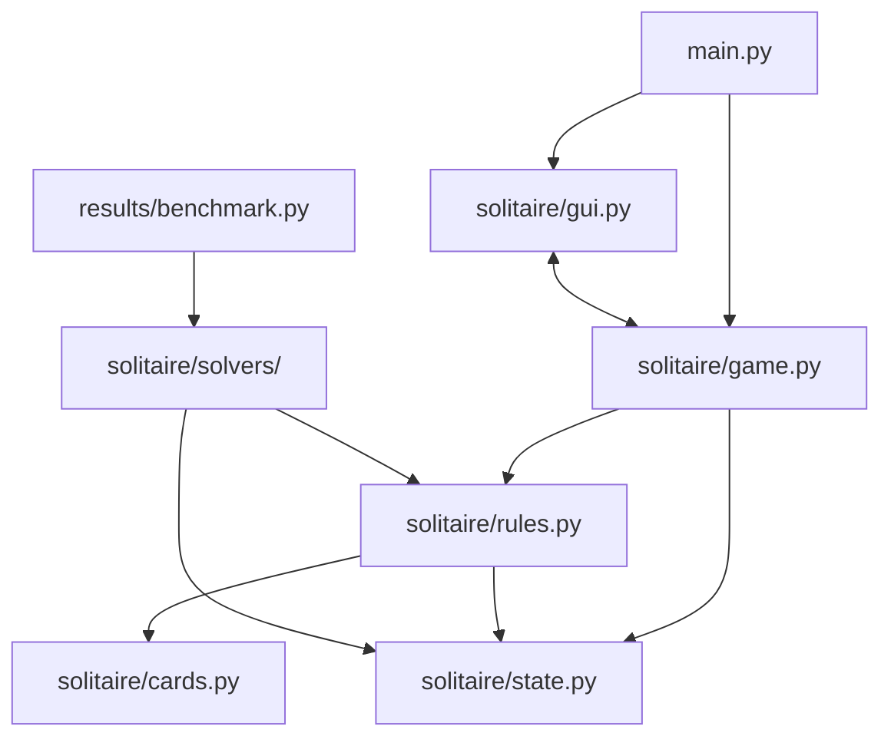

# Proposed architecture (design only)

```mermaid
flowchart TD
    M[main.py] --> GUI[solitaire/gui.py]
    M --> G[solitaire/game.py]
    GUI <--> G
    G --> R[solitaire/rules.py]
    G --> S[solitaire/state.py]
    R --> C[solitaire/cards.py]
    R --> S
    A[solitaire/solvers/] --> R
    A --> S
    B[results/benchmark.py] --> A
```

This is a **planning diagram**; these modules are not implemented yet.
